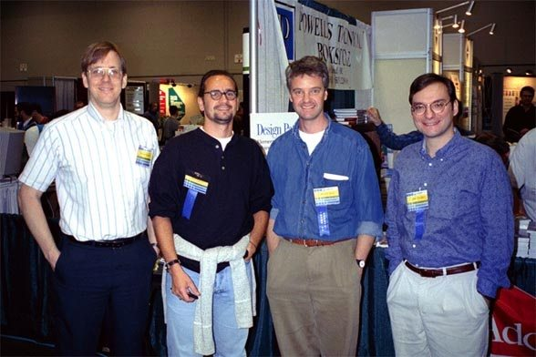
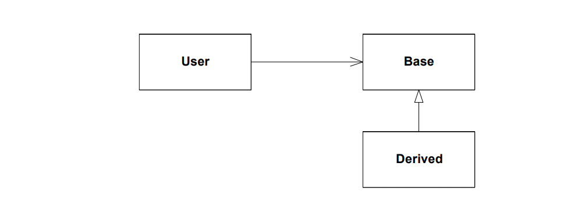
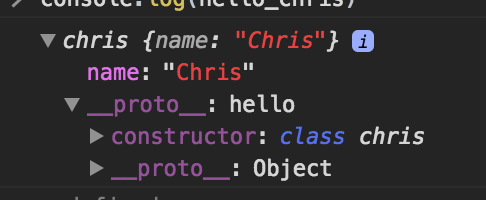
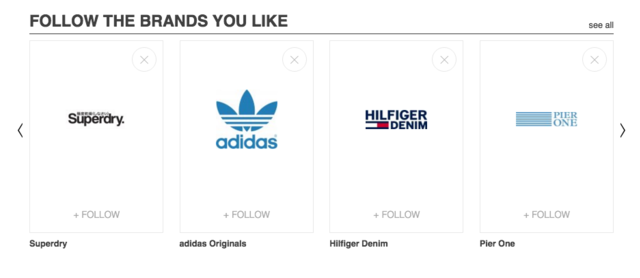
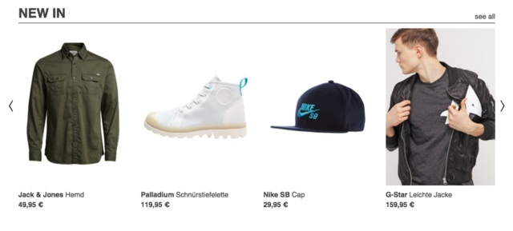
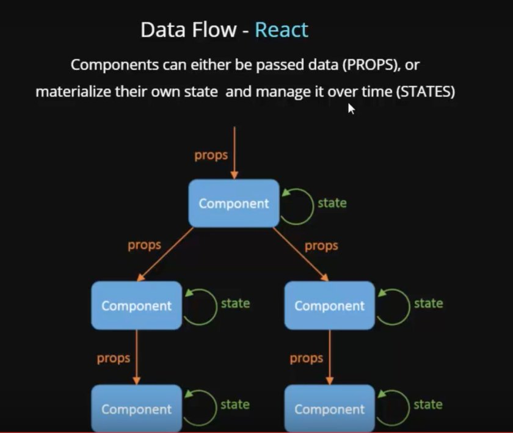
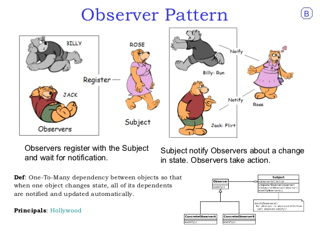

class: center, middle
# Design Patterns in React

Josh Martin
---

class: center, middle
# Introduction
---

# Introduction
#### Structure of Presentation
    
--

1.  What is a Design Pattern

--

2.  Principles of Design
--

3.  Design patterns
---

# Introduction
#### Structure of Presentation
--

####  Design patterns

--
* Creational
--

    - Prototypes
    - Factory Method
--

* Structural
--

    - Adapter
    - Composite

--
* Behavioral
--

    - State
    - Command
    - Observer
---
class: center, middle
# What is a Design Pattern?
---

# What is a Design Pattern?

* A **Design Pattern** is a general repeatable solution to a commonly occurring problem in software design.

* Design Patterns is all about writing clean, reuseable code.

* Helps create a common language between Developers

<div style="display:flex;" >
<div>
 
</div>
<div style="flex:2;"></div>
<div>

</div>
</div>
---

# What is a Design Pattern?

* Each Design Pattern has four parts:
    - **Pattern name** a handle we can use to describe a design pattern, its solution and cosequences in a word or two.

    - **Problem** describes when to use the pattern. Explains the problem and its context.

    - **Solution** provides an abstract description of a problem and how a general arrangement of elements solves it.
    - **Consequences** the results and trade-offs of applying the pattern (often space or time trade-offs).
---

# What is a Design Pattern?

#### Types of Design Patterns

1. **Creational**
    -   Concerned with the process of creating objects

2. **Structural**
    - concerned with the structure of objects

3. **Behavioral**
    - concerned with how objects interact
---

---
class: middle,center
# Principles of Design 
---
# Principles of Design 

#### Inheritance
    
* When an object is derived from another object

* "Is A" relationship 

* Often Inheritance breaks encapsulation.
    - implementation of a subclass becomes tied up with implementation of its parent. Any changes to the parent will cause changes to the subclass. 
---
# Principles of Design 

.center[]
---
# Principles of Design 

#### Composition

* Type of Aggregation
    - **Aggregation** is when compose a component such that it made of up of other component

    - "Has a" relationship

* focused on what a things does and not how things are related

* Allows for more complex functionality

---
# Principles of Design 

#### Composition
```html
<App>

    <Header /> 
    <Router>

        <Main />
        <About />
        <Projects />

    </Router>

</App>
```
---
# Principles of Design 
#### Coupling
--

* React is loosely coupled framework
--

* **Coupling** is the degree of interdependence between software modules.

    - Tighly Coupled
    - Loosely Coupled
--

*  **Cohesion** is the degree of which elements inside a component belong together

    - Loosely Coupling -> High Cohesion
    - Tighly Coupled -> Low Cohesion
---
# Principles of Design 

#### Understanding SOLID Priniciples of Object Oriented Design
* **S**ingle Responsibility 

* **O**pen-close Priniciples 

* **L**iskov Substitution

* **I**nterface Segregation 

* **D**ependency Inversion 
---

# Principles of Design 

#### Understanding SOLID Priniciples of Object Oriented Design
* **Single Responsibility**
    -   A class/function should only have one job

* **Open-close Priniciples**
    -   Objects should be open for extension, but closed for modification.

    -   Able to add new features/compenents without breaking code.

    -   Shouldn't introduce breaking changes to existing code.
---

# Principles of Design 

#### Understanding SOLID Priniciples of Object Oriented Design

* **Liskov Substitution**
    

    - Derived classes should swapable with the class(es) it inheritances from (it's base class).

    - The user of the base class should continue to function, if a derived class is passed instead. 
---

# Principles of Design 

#### Understanding SOLID Priniciples of Object Oriented Design

* **Interface Segregation**
    - A client should never be forced to implement an interface that it doesn't use 

    - Should not be forced to depend on methods it does not use.

---

# Principles of Design 

#### Understanding SOLID Priniciples of Object Oriented Design

* **Dependency Inversion** (Dependency injection) 

    - High level modules must not depend on the low level module, but they should depend on abstractions.

---
# Principles of Design 

#### Principles of Rotton Design

   Code is always beautiful, when it is new. 

However, as the code ages it can to begin to rotton, form a few ugly warts, and a few bad hacks.
---
# Principles of Design 

#### Principles of Rotton Design
* **Rigidity** is how difficult is your software is to change

* **Fragility** is tendency to break when someone changes the code

* **Immoibility** inability to be reused in other project

* **Viscosity** how hard is it to use
.center[
[Great Article on Rotton Design](http://www.cvc.uab.es/shared/teach/a21291/temes/object_oriented_design/materials_adicionals/principles_and_patterns.pdf)]
---
class: center
# Design Patterns
### Creational Patterns
---
# Prototype
--

* Creational Design Pattern

* Creating new objects by cloning other objects

* Prototypes is how Javscript achieves inheritance

* Classes are just abstractions on top of the **Prototype Inheritance Model**

* This Prototype modal allows to use the `new` keyword on our functions and classes in javascript.

    - creates an object and check the prototype of whatever it is being called on (e.g. `const josh = new person('Josh');` )

* functions use the keyword `prototype`

.center[]

---
## basic example of a class
<iframe width="100%" height="310" src="//jsfiddle.net/cjoshmartin/9LvjLL31/embedded/js,result/" allowpaymentrequest allowfullscreen="allowfullscreen" frameborder="0"></iframe>
---
## Functions
<iframe width="100%" height="400" src="//jsfiddle.net/cjoshmartin/8ehkrrgn/embedded/js,result/" allowpaymentrequest allowfullscreen="allowfullscreen" frameborder="0"></iframe>

---
## Inheritance
<iframe width="100%" height="500" src="//jsfiddle.net/cjoshmartin/hak37x3b/1/embedded/js,result/" allowpaymentrequest allowfullscreen="allowfullscreen" frameborder="0"></iframe>
---
## Recreate this using prototypes
<iframe width="100%" height="500" src="//jsfiddle.net/cjoshmartin/hak37x3b/1/embedded/js,result/" allowpaymentrequest allowfullscreen="allowfullscreen" frameborder="0"></iframe>
---
## Create our basic "class"
```javascript
// Basic `class` and defualt constructor
function hello(name){
  this.name = name;
}

// Adding a function to our `class` of `talk`
hello.prototype.talk = function(){
  return `Hello ${this.name}!`
}

// Create a instance and use it!
const say_hello = new hello('Josh');
const selector = document.querySelector('.test-center');
selector.innerHTML = say_hello.talk();

```
---
## Lets extend our basic "class" like normal

<iframe width="100%" height="450" src="//jsfiddle.net/cjoshmartin/kaqxfkLz/embedded/js,result/" allowpaymentrequest allowfullscreen="allowfullscreen" frameborder="0"></iframe>
---
## Lets extand our basic "class" only using prototypes
<iframe width="100%" height="500" src="//jsfiddle.net/cjoshmartin/8m3hon57/embedded/js,result/" allowpaymentrequest allowfullscreen="allowfullscreen" frameborder="0"></iframe>
---
# Factory Method
--

* Creational Pattern

* Use to deal with creating objects or components.
* classes can be choosing at run-time 
---
# Factory Method
#### Brands Component
.center[]
---
# Factory Method
#### Articles Component
.center[]
---

# Factory Method
#### Data
```javascript
const  items = [
   {	
	      source: ‘brand’,
      	title: ‘title’
   }	
]
const renderedItems = items.map((item) => SlideFactory.build(item));
```
--

#### Factory
```javascript 
export default class SlideFactory {
    static build(data) {
        switch (data.source) {
            case 'brand':
                return <BrandFeedSlide slideData={data}/>;
            case 'article':
                return <ArticleFeedSlide slideData={data} />;
            default:
                return undefined;
        }
    }
}

```
---

class: center
# Design Patterns
### Structual Patterns
---

# Adapter

--

* Structural Pattern

* Commonally called a _wrapper_

* Converts  one type of object to another type of object that the client expects

* Make up of:
    - **Target** which is the object the client interacts

    - **Adaptee** what the client wants to interact with but can not  

    - **Adapter** makes the connection between the Target and Adaptee
---
# Adapter

```javascript
HTTP.get('https://jsonplaceholder.typicode.com/posts/1', (error, response) => {
  if (error) {
      console.log(error);
        } else {
            console.log(response);
              }
              });
```
--
```javascript
JSONPlaceholder.posts('get', 1);
```
---
# Composite

* Basically just a Tree, that can represents both primitives and their containers.


---
# Composite
* `render()` function creates a tree of React Elements

    - on the next state change or update of props, the `render()` function will return the different in the tree of React elements

* React Algorthim for constructing the trees has a time complexity of **O(n)**

.center[]
---
# Composite
```javascript
  shouldComponentUpdate(nextProps, nextState) {
    if (this.props.color !== nextProps.color) {
      return true;
    }
    if (this.state.count !== nextState.count) {
      return true;
    }
    return false;
  }

```

```javascript 
ReactDOM.umountCompenentAtNode(container)

ReactDOM.findDOMNode(component)

ReactDOM.createPortal(child, container) // add nodes to the tree
```
---

class: center

# Design Patterns
### Behavioral Patterns
---
# State
--

* Behavioral design pattern

* React has both Stateful and Stateless Components

.center[


]
---
## State
#### Stateless (Functional Based Components)

* uses `render`, `props`, and `context`

* A lot of times used as a View

```javascript
export const props_Tacos = (props) => {
    return (
        <div>
        {props.has_tacos}
        </div>
    )
} 
```
---
## State
#### Stateful (Class Based Components)

* uses `render`, `state`, and `lifecycle methods`

* A lot of times used as a Controller
```javascript
export default class Tacos extends Component {

    constructor(props){
        super(props);
        this.state ={
        has_tacos: false,
        }
    }

    render(){ 
    
    return( <props_Tacos {... this.state} />
    
    );
 }
}
```
.center[[Cool Video on State](https://www.youtube.com/watch?v=YaZg8wg39QQ)]
---
## State
#### Immutability 

--
* **Mutable** meaning the value can be changed later on

--

* **Immutable** meaning the value **cannot** be reassigned later on

```javascript
    const immutable = 'nana-a-boo-boo, you cannot change my value';
    
    immutable = 'I will try'; // TypeError: Assignment to constant variable.
```
---

## State
#### Immutability 

*   Immutability is a great feature

    - In React, `props` are immutable. Which prevents a conflict in their shared state.

    - One way data flow 
---
## State

.center[]

---

## State
#### Immutability 

*   Immutability is a great feature

    - In React, `props` are immutable. Which prevents a conflict in their shared state.

    - One way data flow 
--

.center[]
---

## State
#### Immutability 
*   Immutability is a great feature

    - In React, `props` are immutable. Which prevents a conflict in their shared state.

    - One way data flow 


---

## State
#### Immutability 

*   Immutability is a great feature

    - In React, `props` are immutable. Which prevents a conflict in their shared state.

    - One way data flow 


.center[]
---
# Command 
--

* Behavioral Pattern

* A generic way to call a functon without know it's complex behavior
    - `render()` function would be an example of this
    - Another example on next slide
---
# Command
```javascript
class Commands {

  constructor() {
    this._commands = [];
  }

  store(command) {
    this._commands.push(command);
  }

  execute() {
    const top = this._commands.pop();
    top.execute(); // helps makes commands more general
  }

  numberOfCommands() {
    return this._commands.length;
  }
}
```
---
# Command
```javascript
class Add {
  constructor(num1, num2) {
    this.num1 = num1;
    this.num2 = num2;
  }
  execute() {
    console.log(' The sum of these numbers:', this.num1 + this.num2);
  }
}

class Subtract {
  constructor(num1, num2) {
    this.num1 = num1;
    this.num2 = num2;
  }
  execute() {
    console.log(' The subtraction of these numbers:', this.num1 - this.num2);
  }
}
```
---
# Command

```javascript
const cmd = new Commands();

cmd.store(new Add(3, 2));
cmd.store(new Subtract(3, 2));
```
```javascript
while (cmd.numberOfCommands() > 0) {
  cmd.execute();
}
```
```bash
 The subtraction of these numbers: 1
 The sum of these numbers: 5
 ```
---
# Observer
--

* Behavioral Pattern

* Used when you have many other objects that need to receive updates when another object changes
    - **Subject** maintains a list of dependents

    - **Observers** are what the subject notifies of any state change automatically

* the Subject does not need to know about the observers.

* Key part in MVC architectural
---
class: center,middle

---

.center[
# End
@cjoshmartin

[cjoshmartin.com](http://www.cjoshmartin.com)

[contact@cjoshmartin.com](mailto:contact@cjoshmartin.com)

]
